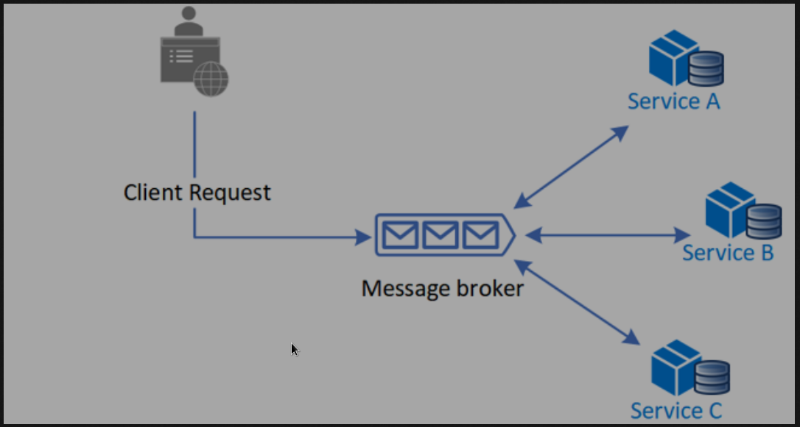

# Pheww!!! Finally done. 😮‍💨

(Press `ctrl+shift+v` to view better if in vscode)
(Apologies if my grammar is not correct or spelling mistakes, it's 2 in the morning. And I've covered only the main parts of the whole app and left lot of insignificant stuff like formatting/validating the methods in csv, or reading from .env files effectively, etc..)

It is 12 in the midnight. I think I've been working on this for the entire day (Finished at 2AM).
It was a good project but the time limit was too low(1 day).
Hope I will be judged based on the time limits 🥲.

Anyways let's get started 💪 and wrap this up because this has been a very hectic week for me.

Let's first discuss the given things and then implemented HLD of the project.
And what actually have been implemented.

## Requirements

1. Receive a request with CSV, and return a response immediately
2. CSV format will be as follows:

    - S.no
    - Product Name
    - Input Image URLs
3. Image URLs itself will be in comma separated structure
4. CSV validation (if fails then immediate response should be sent, instead an error)
5. Process the image, and compress it by 50% (Asynchronously).
6. Store the result
7. A separate API for checking the status of the specific job

## HLD by Me

This app is following the above HLD design pattern. And it is called SAGA pattern or you can also call it master/worker pattern.

Actually there wasn't even a room of any other pattern since the requirements were so specific.

But to brief on the pattern, in this pattern our master and workers, both of them are scalable individually. And independent of each other, which gives us the very strong plus point when our background tasks take longer than the optimal time. Not only such scenarios this pattern is good for general scaling as well.

Note: I know you guys asked for UML in draw.io. But I've not used it extensively as of now. I could do basic design with it but then that would have been worse. So here I've added an image for better understanding. Also trying my best to write the docs properly.

### In short, this pattern involves:
- master: which enqueues the data to a broker/db/mediator and sends response immediately
- broker: which stores the data until and unless there is a worker available to pick the data
- worker: who actually performs the job

If you have read the above points then congratulation, you have got my HLD overview.

There is so much to talk on each on every folder that, this file alone can't do justice to it.

But still I will try to stick to main points just so that I don't end up boring you to sleep.

### Things talked in detailed are:

- [Redis DB](#redis-connection)
- [RQ Library](#what-is-rq)
- [Workers (Business logic, with Async approach)](#worker)

### Redis Connection

In this, I've chosen **redis** specifically due to the lack of time. But in an actually production deployment, definitely kafka is the way to go. Which would ensure the scalability of our third components as well.

For maintaining the connection with redis, I created a manager class. This class follows a singleton design pattern, which ensures that the object of this class is not created more than once.

And the singleton pattern implementation, also tries to keep multi-threading in check so that it won't gets initialized more than once. Using double locking to prevent lock overhead as well.

Not only is this class ensuring that the redis connection is being maintained properly, it is also wrapping around the RQ library, which makes it so easy to use and for co-workers to use without even knowing that there 2 packages working in sync.

### What is RQ?

RQ short for Redis Queue. If you haven't heard about it then let me name some other similar libraries like celery, huey, Dramatiq, etc.

#### Why choose this then?
This library for fairly simple to implement compared to celery as well. I even went to check out some internal code. So it was more easier to tinker or work with. It also had relatively lot smaller docs when compared to any other, which made it the ideal choice.

This library was very light-weighted and easy to work with. With so many custom options and to be able to detach or attach any component of the app.

Though it still had some issues like, it didn't support async function or async enqueuing/dequeuing from redis queue.
Celery was providing async function but not the async enqueuing to the queue.

#### Why was sync enqueue an issue?

Because I was using fastAPI with uvicorn. Uvicorn is an asynchronous server which support async functions. Though I was not able to use it's full potential because of this limitation of the enqueuing not being async.

So I had to make my API methods as general functions instead of async functions. Because if they would still be an async function and perform a blocking network call that would have **blocked our async event loop**.

So uvicorn/fastapi would have handled a sync function differently and ran it on a different thread. So this is how I went around this issue. Hope this one actually was as interesting to you as it is for me.

Although the issues could be avoided with Kafka.

#### How does rq work internally?

Just in case if you want to know then it using queue data structure in redis and fetching them using pub/sub architecture.

### Worker

I really want to write a lot more in detail, but it is getting quite late and I also have some other tasks tomorrow.
So let's wrap with this one only.

Since I'm using [RQ](#what-is-rq) library, I'm also using it's worker to process the jobs enqueued into the queue.

This worker itself is synchronous, i.e., it dequeues data one by one and only process next task after the previous one has finished. That actually is the best flow for us.

#### How to improve performance inside this synchronous worker?

Fist let's understand what exactly does it mean to receive a single job.

Receiving a job, means receiving the entire csv in one go. That means we have all the urls at the beginning of the job. So now we can optimize this because we will be making alot of network calls while running this job. In our master component we have already brought it our desired format for processing the data.

We will receive a list of objects of:
- sno
- name
- urls

Here the most important part is `urls`. These urls are not  comma separated urls' string. But a list of validated proper urls (used `urllib` library for validation)

Now we will have a row of all the rows present in the csv.
And each row will run in different async function. And even within each, since each row can have multiple urls, will run in an async function.

#### How we are processing images?

Once we have received the data. I'm using PIL for processing images synchronously.
Here if we had another server which would serve the request then that could also be an async operation.

I tried looking into opencv, for the required task but it seemed to be having too large docs for a single day implementation. Although I did try it's basic cpu versions, where PIL was always the winner. I think if we could use some models with it, the results could be much much better.

The compression itself is on a very rookie level.

Though I'm not a ML/AI/Data Scientist myself, and I mostly focus on building scalable systems. But yes, I have worked with some these things as well. But mostly on the structural level. And simple bedrock API calls and all.

#### After the image processing

Once the images are processed I've used aioboto3 for insertion of the data asynchronously to a s3 bucket.

It's 2 years since I used boto3, so I didn't remember whether I should be creating a client every time or not??

But I found all the docs, even amazon itself showing examples where it was creating it on the fly.
But they were showing a single object insertion script so I was a bit confused.

But found a solution from digitaloceans: `https://www.digitalocean.com/community/questions/should-i-create-a-new-instance-of-boto3-client-for-each-file-upload-request-or-use-a-shared-instance`

Which should have improved it's performance a bit if not much.

Though the async call to store the data is already a lot more effective.

After finishing this up, it sends a callback to it's original client.
And it is also sending the data as well in the callback's post request in json body.

# Best practices used
I have tried incorporating as many best practices I could but in the limited time I could only do so much.

- I have used poetry for dependency management.
- Wrote all documentations as well as I could with all minor details.
- Separated out the smaller chunks into different portions for example: Redis and it's manager, Common main_logger (which can be used by worker as well to initialize it's own logger)
- pre-commit
- logs (Although very basic)
- pydantic schema and settings
- .env variable loading
- Although I wanted a bit more checks but since I was running out of time, there could be bugs here and there. 

## Confession
Out of the 7 points of requirements. I have completed all of them except (point 6) I'm not storing 
the result in any Database after the process. I saw this point only after finishing and then it would have took 1hr just to first configure db and all. So I left that part, rest all is as expected.

Although a well built project, but it has only been tested it the enqueuing project. Because to test the worker I need a s3 bucket as well. Which would been another big task, but if you go through the logic, then the logic would be clear as to what I'm trying to do.

You can also connect with me if any doubts or any suggestions or any criticism.

Just in case if you are expecting me to use some models and some high quality image compression techniques. Then I'm sorry to disappoint you I'm not using any of those.
