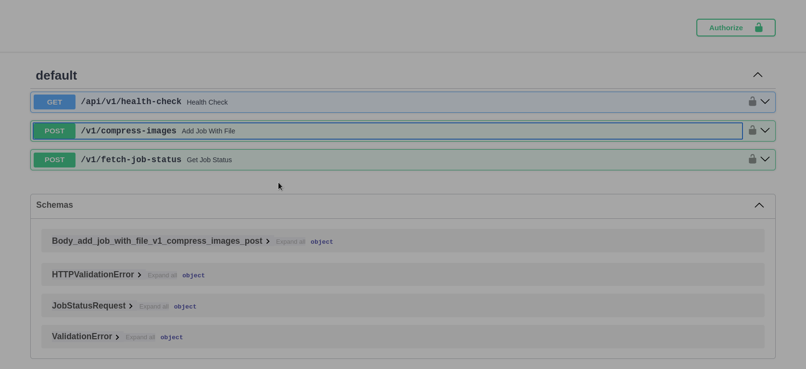

# Image Comperssor Documentation

#### Personal Requst
Hi Author here. Regardless of whether you like it or not. I would request you to send me a feedback on the project.
You can mail me on [Hello Author](mailto:thsibtima1999@gmail.com).
Or text me on [LinkedIn Profile](https://www.linkedin.com/in/amit-bisht-4b07b3201/)

If you suggestions for improvement or you feel it should not been in this way, then I'm open to criticism as well.
So would love to get in touch if you guys are interested.

First of all if viewing these docs in vscode press "ctrl+shift+v" to view in better context. This docs will walk you through on the APIs available to interact with the Image Comperssor.
This doc only contains info on how you can use it.
If you want my personal takes on the project, like issues I faced, things I have done while making these change,
then please refer to [My person experience](EXP.md) file.
I have tried to be a bit more technical while being concise as well.

This file only has the documentation regarding the app.
Thanks and how you like it!

## How can you test it more efficiently?
I"ve not provided any postman collection for this project since fastapi already supports swagger UI(which lists all endpoints with the fields that must be sent), which should be sufficient enough for testing the endpoints.
And if you fell more comfortable with some other UI, you can copy the paths and data from swagger UI to postman.
If you want to see how swagger UI looks. You can see the image below.

Or go to the next steps of setups, [Authentication and Authorization](#authentication-and-authorization)



### How to access it?
Well before that the question should be how to get all the components of the project running.
So let"s first start the project then lets move on to accessing the docs.

#### Starting the project
Since we are starting the project, we should have some knowledge as to what components are present in the entire app.
At higher level there 3 components in the app. All of which are independently scalable.
- **Redis/Broker (Queue to store messages)**
- **FastAPI (Endpoints availabe for interaction)**
- **Background workers**

Why did I pick this stack? I will write about that in [My person experience](EXP.md)

##### How to build enviornment?
I have used python=3.11.9. Go to [pyproject.toml](pyproject.toml), for build dependencies.
I used poetry for dependency management so you can install all the dependancies using poetry.
First create the env as you normally would and then install poetry using `pip install poetry`.
Now run `poetry install`.
Just in case if you face any issues while doing so, then you can go to [pyproject.toml](pyproject.toml).
And copy the dependacies under "[tool.poetry.dependencies]" to a requirements.txt, and install normally.
Or you can run them manually as well.

##### Redis
So first, we have to start the redis. You can start redis using the docker-compose file but for this you will need docker installed in you system. You can either install this and run `docker-compose up -d redis` (you have to be in the root dir of this project for this to run).
Or you can just install it on your system directly.

##### FastAPI
If all dependacies were installed correctly, then you must have uvicorn now.
Verify it using `uvicorn --version` or `python3 -m uvicorn --version`.
Now run fastapi project using `uvicorn app.main:app`.

## Authentication and Authorization
To get authenticated send API key in header of the request
- **key name**: x-api-key
- **key value**: ""

By default it does not authenticate anyone. But to enable authentication you can define "API_KEY", in a .env file.
It is the API_KEY/Token for authentication.
Then while running you will have to send this key in the request header with key as `x-api-key` and value as defined.

To use this in swagger enter it in the box found in the top right corner. (Only needed if token has been set)

## General Responses
Before getting to know about the APIs, lets get to know about the general responses sent by the app. This will help in easier and faster debugs in future.

- ### Status Code: 200
    - Means the request has processed normally and everything has been fetched as expected.
    - #### Response
        - Depends on the requested API
- ### Status Code: 404
    - Generally occurs due to unfound resources (Incorrect URLs)
    - for example sending request on path: "/item/" instead of "/items/"
    - #### Response
        - content_type: "application/json"
        - ```json
            {"detail":"Not Found"}
- ### Status Code: 422
    - Occurs when the some value which must have been passed is missing
    - That value can be anywhere like headers, request body or parameters
    - Generally to get to know about compulsory values refer to specific [API Docs](#api-docs)
    - Even the response will help to show the issues.
    - #### Response
        - content_type: "application/json"
        - ```json
            {
                "detail": [{
                    "loc":["query","id"],
                    "msg":"field required",
                    "type":"value_error.missing"
                }]
            }
        - In this case a query parameter named "id" is missing
- ### Status Code: 405
    - Occurs when incorrect method is used to access a resource
    - Check [API Docs](#api-docs) for correct HTTP method to be used with the API endpoint
    - #### Response
        - content_type: "application/json"
        - ```json
            {"detail":"Method Not Allowed"}
- ### Status Code: 500
    - Occurs when there is some issue from our end
    - Let us know if you encounter such issues
    - ### Response
        - content_type: "text/plain"
        - "Internal Server Error"


## Overview
As of now, the API provide endpoints for:
- [Check APP"s Health](#check-app-health)
- [Sending CSV with URLs](#csv-job-insert)
- [Check Job"s Status](#check-job-status)

## API Docs
This section provides docs for all APIs present for use

### Check App Health
- **URL:** `/api/v1/health-check`
- **Method:** `GET`
- **Description:** Used to check the status/health of the app(Can be used by load balancer/docker etc.)
- **Parameters:**
- **Response:**
    - content_type: "application/json"
    - status code-200: Returns a json response

### CSV Job Insert
- **URL:** `/api/v1/compress-images`
- **Method:** `POST`
- **Description:** Used to enqueue jobs to the queue using csv files.
- **Parameters:**
    - callback: the callback that you want when the processing is finished. Callback will receive a post request with json body.
    - file: CSV/XLSX file with the data. We only allow the data if it in perfect condition, i.e., only if the data is in expected format for all columns and rows. Else we will not accept the file.
    - ```json
        {"file": "<file>", "callback": "http://google.com/"}
- **Response:**
    - content_type: "multipart/form-data"
    - status code-200: Returns a json response
    - ```json
        {
            "job_id": "a6cf1fbd-c9c3-4de4-ad72-4cc5da4544a3",
            "job_status": "queued"
        }

### Check Job Status
- **URL:** `/api/v1/fetch-job-status`
- **Method:** `GET`
- **Description:** Used to Fetch the status of the job.
- **Parameters:**
    - job_id: Send the job_id of the job you want to monitor
    - ```json
        {"job_id": "<uuid>"}
- **Response:**
    - content_type: "application/json"
    - status code-200: Returns a json response
    - ```json
        {
            "result": "string",
            "created_at": "string",
            "started_at": "string",
            "ended_at": "string",
            "error": "string"
        }
    - ```json
        {
            "status": "queued",
            "result": null,
            "created_at": "2024-08-31T17:58:03.907692",
            "started_at": null,
            "ended_at": null,
            "error": null
        }
    - Possible `status` values `"queued", "finished", "failed", "started", "deferred", "scheduled", "stopped", "canceled"`


# Signouts
Since now you have gone throught the basic docs, I would recommned you to read [My Development Experience](EXP.md) as well.
